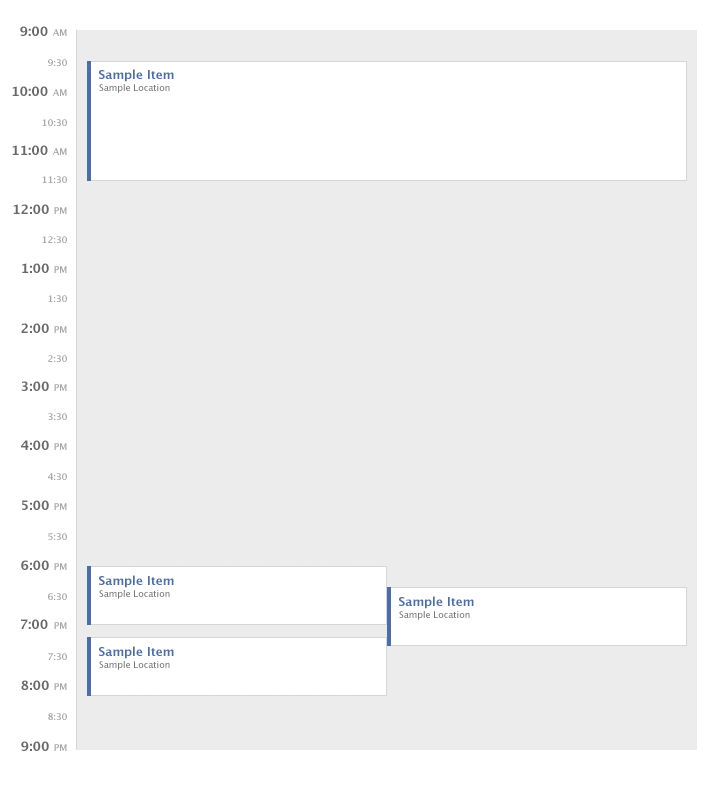

# Inato challenge
Le but de cet exercice est de "render" des événements sur un seul jour d'un calendrier.
Le layout du calendrier devra respecter 3 règles :

1. Les événements ne peuvent pas visuellement se chevaucher;
2. Si deux événements entrent en collision dans le temps, ils doivent avoir la même largeur.
3. Un événement devrait utiliser la largeur maximale disponible, mais la contrainte 2 l'emporte sur cette contrainte.

Chaque événement est représenté par un objet JS avec une propriété "start" et "end". La valeur de ces propriétés est le nombre de minutes depuis 9h.
Par exemple `{ start: 30, end: 90 }` représente un événement de 9h30 à 10h30. 
Les événements doivent être render dans un conteneur qui est large de 620px (600px + 10px de padding à gauche et à droite ) et haut de 720px (la journée se terminera à 21 heures).
Le style du résultat doit correspondre à la capture d'écran en pièce jointe.

L'application doit être réalisée en React et doit exposer sur le namespace global une fonction 'layoutDay'. Cette fonction prend en paramètre un array d'événements et affiche les événements en respectant les règles données.

Au premier affichage le calendrier doit afficher les événements suivants : 

`[ {start: 30, end: 150}, {start: 540, end: 600}, {start: 560, end: 620}, {start: 610, end: 670} ];`

La capture d'écran ci-dessous correspond au résultat attendu.

L'algorithme de layout pour les événements devrait être aussi performant que possible (essaye d'optimiser la complexité en temps).
